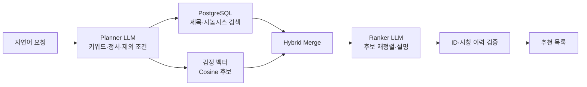

> **LLM 애플리케이션 / AI 백엔드 엔지니어링** — 자연어로 표현된 취향을 검색 가능한 신호로 바꾸고, LLM·검색·백엔드의 역할을 분리해 실제 추천 서비스 흐름으로 연결한 경험입니다.

## Repository

- **Frontend**: [SpringDaylight/Bolrea-Malrea-Frontend (develop)](https://github.com/SpringDaylight/Bolrea-Malrea-Frontend/tree/develop)
- **Backend**: [SpringDaylight/Bolrea-Malrea-Backend (develop)](https://github.com/SpringDaylight/Bolrea-Malrea-Backend/tree/develop)
- **GitOps**: [SpringDaylight/Bolrea-Malrea-Gitops](https://github.com/SpringDaylight/Bolrea-Malrea-Gitops)

## Service

**볼래말래**는 사용자가 “직장 상사와 관련된 영화”, “겨울밤 분위기의 영화”처럼 원하는 맥락을 자연어로 입력하면 후보 영화와 추천 이유를 함께 보여주는 AI 영화 추천 서비스입니다. 장르 필터만으로 담기 어려운 **정서·상황·서사 맥락**을 서비스 입력으로 다루는 것이 핵심 과제였습니다.

## Problem → Contribution

| 관찰한 문제 | 내가 한 일 | 의미 |
|---|---|---|
| 정서 유사도만으로는 상황 키워드를, 키워드 검색만으로는 감정 맥락을 놓칠 수 있음 | **감정 벡터 코사인 후보와 DB 제목·시놉시스 후보를 결합하는 Hybrid Retrieval 구조를 제안** | 서로 다른 검색 신호의 약점을 보완하는 후보 생성 구조로 전환 |
| 규칙만 늘리면 표현 변형 대응이 복잡해지고, LLM에 전부 맡기면 결과 통제가 어려움 | 추천 로직을 검토하며 **규칙 기반 처리와 LLM의 역할을 분리하고 조합 방향을 구체화** | 자연어 해석은 LLM, 후보 생성과 검증은 애플리케이션이 담당 |
| 별도로 구현된 추천 로직이 사용자·DB·API 흐름과 분리되어 있었음 | 추천 기능을 **FastAPI 서비스에 연결**하는 통합 작업을 완료 | AI 로직을 단순 호출 예제가 아닌 실제 서비스 기능으로 연결 |

## LLM Application Pipeline

LLM은 DB에 없는 영화를 새로 만들어 추천하는 것이 아니라, **사용자 요청을 해석하고 제한된 후보를 재정렬하는 역할**을 담당합니다. 백엔드는 후보 병합, 최대 후보 수 제한, 반환 ID 검증, 시청 이력 제외와 대체 처리(fallback)를 통해 LLM이 서비스 데이터의 범위를 벗어나지 않도록 제어합니다.

## Iteration — 검색 결과를 보며 구조를 개선하다

동일한 자연어 질의를 반복 실행하며 결과가 **부정 표현·상황 맥락·감정 표현**을 어떻게 해석하는지 관찰했습니다. 규칙을 계속 추가하는 방식은 문장 표현이 달라질 때마다 복잡도가 커졌고, 정서 기반 검색만으로는 명시적인 상황 키워드를 놓치는 한계도 확인했습니다. 이를 바탕으로 두 검색 결과를 결합하는 Hybrid Retrieval 구조를 제안하고, 프롬프트와 검색 단계가 각각 어떤 역할을 맡아야 하는지 반복적으로 검토했습니다.

| 단계 | 역할 |
|---|---|
| Planner | 자연어를 `keywords`, `mood`, `genres`, `exclude` 등의 구조로 변환하고, 실패 시 규칙 기반 대체 처리 사용 |
| Retrieval | PostgreSQL ILIKE 후보와 20차원 감정 벡터의 코사인 후보를 각각 생성 |
| Merge / Rank | 영화 ID 기준으로 후보를 병합한 뒤 제한된 후보만 LLM이 재정렬 |
| Guardrail | 후보 ID 허용 목록(allowlist), 시청 이력 재검증, 설명 생성 실패 시 대체 처리 적용 |

## Backend Integration & Deployment

FastAPI endpoint에서 동기 추천 오케스트레이터를 `asyncio.to_thread()`로 실행해 event loop가 블로킹되지 않도록 처리하고, SQLAlchemy를 통해 PostgreSQL의 영화·사용자·`MovieVector` 데이터와 연결했습니다. 프로젝트에서 Backend·DevOps 역할을 맡아 추천 API 통합과 AWS 배포 흐름을 경험했습니다.

**프로젝트의 AWS 배포 구조:** `Jenkins → Kaniko → ECR → GitOps → ArgoCD → EKS`. Jenkins 파이프라인에서 Kaniko가 애플리케이션 이미지를 빌드해 ECR에 저장하고, 변경된 이미지 태그가 GitOps 저장소에 반영되면 ArgoCD가 이를 감지해 EKS Deployment를 동기화하는 구조입니다.

## Technical Decisions

| 결정 | 선택 기준과 트레이드오프 |
|---|---|
| PostgreSQL `MovieVector` 저장 | 프로젝트 데이터 규모와 운영 복잡도를 고려해 별도 벡터 엔진을 추가하지 않고 기존 DB에 저장하는 방향을 검토했습니다. 현재 검색은 DB row를 읽어 애플리케이션에서 코사인 유사도를 계산하므로, 데이터 규모가 커질 경우 검색 계층을 다시 검토해야 합니다. |
| Planner / Retrieval / Ranker 분리 | LLM이 검색·생성·검증을 모두 맡지 않도록 역할을 나누어 각 단계의 입력과 실패 지점을 관찰할 수 있게 했습니다. |
| 후보 제한과 검증 | LLM에는 DB에서 찾은 제한된 후보만 전달하고, 반환 ID와 시청 이력을 다시 확인해 LLM이 서비스 데이터의 범위를 벗어나지 않도록 했습니다. |

## Result / Learned

- 자연어 추천 품질은 모델 호출 한 번보다 **질의를 구조화하고 서로 다른 검색 신호를 결합하는 파이프라인 설계**에 크게 좌우된다는 점을 배웠습니다.
- LLM 결과를 실제 서비스에 연결할 때는 정상 경로뿐 아니라 후보 제한, ID 검증, 대체 처리, 비동기 백엔드 실행까지 함께 설계해야 함을 경험했습니다.
- 이 프로젝트의 AI 경험은 모델 연구나 추천 알고리즘 전체를 단독 개발한 것이 아니라, **LLM·검색·백엔드·배포를 연결해 실제 서비스 흐름을 만든 애플리케이션 엔지니어링 경험**에 가깝습니다.
