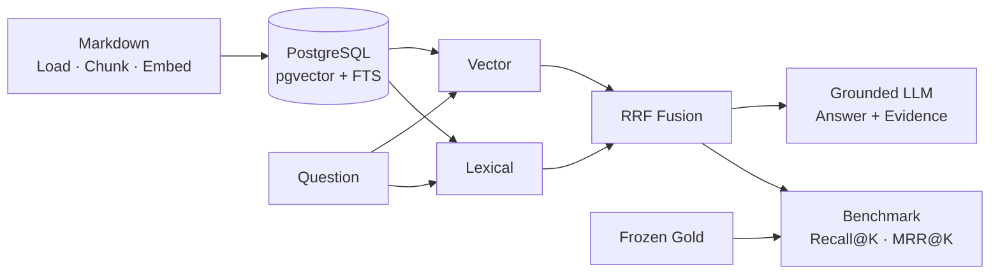

## 사용성과 검색 품질을 평가하며 개선한 RAG 지식 검색 시스템


> **기업 지식 RAG를 직접 구현하고, 사용성과 Retrieval 품질을 측정하며 개선했습니다.**

## Project Background

AI 영화 추천 서비스에서 `자연어 요청 → 정보 검색 → LLM Context → 추천` 흐름을 구현하며, LLM 서비스의 품질은 모델뿐 아니라 **어떤 정보를 검색해 제공하는지**에 크게 좌우된다는 점을 경험했습니다. 이를 기업 지식 검색 문제로 확장해, Retrieval 품질을 정량적으로 측정하고 개선할 수 있는 RAG 시스템을 구현했습니다.

추천 품질에는 사람의 선호 판단이 필요해 human evaluation을 활용했습니다. 반면 Retrieval은 질문별 Gold Evidence를 정의할 수 있어 Recall@K와 MRR@K로 측정했습니다. **문제의 성격이 달라지면 적합한 평가 방법도 달라져야 한다고 판단했습니다.**

## Service Problem / Goal

정확한 문서명이나 표현을 모르는 사용자도 자연어로 질문하면 관련 Evidence를 찾고, 검색된 근거만 Context로 사용해 **Answer + Evidence**를 반환하는 Knowledge Copilot을 구현했습니다.

## Architecture



서로 다른 score scale을 직접 합산하지 않고, 순위 기반 RRF로 Vector·Lexical 결과를 결합했습니다.

## Main Features

| 영역 | 구현한 흐름 |
|---|---|
| Document Ingestion | Markdown 로딩·청킹·embedding |
| Retrieval | pgvector Vector + PostgreSQL FTS Lexical + RRF Hybrid |
| Generation / API | 검색 근거 기반 답변과 Evidence를 FastAPI로 반환 |
| Corpus Lifecycle | 문서별 list·ingest·remove·replace |
| Evaluation | frozen Gold 기반 Recall@K·MRR@K 비교 |


## Problem Solving 01

### 문서를 검색할 수는 있었지만, 실제 corpus를 관리하기 어려웠습니다

직접 사용해보니 현재 corpus를 확인하거나 특정 문서를 삭제하기 어려웠고, 변경 문서를 교체하는 과정도 번거로웠습니다. 문서 하나의 변경 때문에 전체 corpus를 다시 처리하는 방식도 피해야 했습니다.

```text
corpus list        corpus ingest <path>
corpus remove <document_id>      corpus replace <document_id> <path>
```

문서 단위 lifecycle을 구현해 신규·교체 문서만 embedding하고, 삭제 시 관련 chunk와 embedding을 함께 정리했습니다.

> **변경된 문서만 처리해 기존 corpus의 불필요한 재처리를 피하고, 지식 corpus를 지속적으로 관리할 수 있는 흐름을 만들었습니다.**

## Problem Solving 02

### Hybrid Search를 구현했지만 실제로는 Vector와 동일했습니다

정확한 용어와 의미 검색을 함께 다루기 위해 Vector + Lexical 결과를 RRF로 결합했습니다. 그러나 28개 scored case와 3개 diagnostic case의 첫 공식 benchmark에서 Lexical 후보가 한 번도 생성되지 않았고, Hybrid 결과는 Vector와 같았습니다.

<div class="focus-grid">
  <div class="focus-card"><strong>Lexical candidate</strong><span>0/93 → 87/93</span></div>
  <div class="focus-card"><strong>Hybrid ≠ Vector</strong><span>62/93 rankings</span></div>
  <div class="focus-card"><strong>Evaluation trade-off</strong><span>MRR@5 0.9179 → 0.9268<br />Recall@5 1.0000 → 0.9821<br />Ranking ↑ / Evidence Coverage ↓</span></div>
</div>

<strong>“Hybrid가 왜 안 좋아졌는가?”가 아니라 “왜 Lexical 후보가 하나도 생성되지 않았는가?”로 문제를 다시 정의했습니다.</strong>

```text
Natural-language Question
→ 모든 검색 단어를 AND로 요구
→ 일부 표현이 문서에 없으면 candidate 전체 탈락
```

PostgreSQL `plainto_tsquery`가 질문의 모든 lexeme를 AND로 요구해, 핵심 용어가 일치해도 일부 표현이 다르면 후보에서 제외되고 있었습니다. 원인을 **① overlap은 있지만 AND가 제거하는 경우**와 **② 한국어 형태소·cross-language처럼 공통 lexeme 자체가 없는 경우**로 분리했습니다.

Gold·질문·Vector·RRF·candidate depth를 고정하고 **AND → OR candidate 조건만 변경**했습니다. Lexical non-empty는 **0/93 → 87/93**으로 회복했고, Hybrid는 Vector와 **62/93**에서 다른 ranking을 만들기 시작했습니다.

하지만 OR는 common word와 partial identifier 후보도 늘렸습니다. MRR@5는 `0.9179 → 0.9268`로 소폭 높아졌지만 Recall@5는 `1.0000 → 0.9821`로 낮아져, 첫 근거의 순위와 전체 Evidence coverage 사이 trade-off가 나타났습니다.

> **Hybrid의 품질은 결합 방식뿐 아니라 fusion에 들어오는 각 retrieval signal의 품질에도 좌우된다는 점을 확인했습니다.**


## Problem Solving 03

### 후보를 더 많이 가져오면 Hybrid가 더 좋아질까?

최종 Top-K는 고정하고, Vector와 Lexical에서 RRF로 가져오는 source candidate만 1배·2배·3배로 확대했습니다. Gold·질문·retrieval 조건은 그대로 유지하고 candidate depth만 바꿨습니다.

| Recall@5 | Vector | Hybrid 1x | Hybrid 2x | Hybrid 3x |
|---|---:|---:|---:|---:|
| 결과 | 1.0000 | 0.9821 | 0.9524 | 0.9881 |

2x와 3x는 각각 1x 대비 **45/93** execution에서 ranking을 바꿨지만 효과는 양방향이었습니다.

| 개선된 사례 | 악화된 사례 |
|---|---|
| `multi-evidence-02`: 더 깊은 후보에서 두 번째 Gold가 Lexical signal을 추가로 받아 final Top-3에 진입했습니다. | `semantic-paraphrase-03`: noise 후보가 양쪽 retriever의 contribution을 받으며 기존 Gold를 Top-K 밖으로 밀었습니다. |

<div class="decision-callout">
  <strong>Engineering Decision - candidate depth ↑ ≠ retrieval quality ↑</strong>
  <p>더 많은 후보는 relevant evidence와 noise, 검색 비용을 함께 늘렸습니다. 일관된 품질 이득이 없어 실제 query 기본값 <code>source_top_k = top_k</code>를 유지했습니다.</p>
</div>

결과가 좋아질 때까지 파라미터를 조정하는 대신, 사전에 고정한 Gold와 metric을 기준으로 결과를 그대로 보존했습니다. **측정 결과를 근거로 ‘변경하지 않는 결정’도 Engineering Decision으로 남겼습니다.**

## Evaluation / Engineering Decision Summary

- **Recall@K**: 필요한 Evidence coverage / **MRR@K**: 첫 관련 Evidence의 ranking
- frozen Gold와 같은 질문·조건으로 비교하고, 결과를 본 뒤 Gold나 baseline을 수정하지 않았습니다.
- noise를 임의 점수로 만들지 않고 case-level ranking 변화와 Gold displacement로 관찰했습니다.

## Limitations

1. 28개 synthetic scored case는 실제 기업 사용자의 질의를 대표하지 않습니다.
2. 한국어 morphology와 cross-language lexical mismatch는 아직 남아 있습니다.
3. Graph-assisted Retrieval과 ACL은 후속 검증 범위입니다.

> 이 프로젝트의 성과는 Hybrid가 Vector보다 높은 점수를 냈다는 것이 아닙니다. **RAG를 직접 구현하고 사용성과 검색 품질을 정의·측정하며, 예상과 다른 결과를 원인 분석과 통제 실험으로 검증해 기술 선택의 근거를 만든 경험입니다.**
