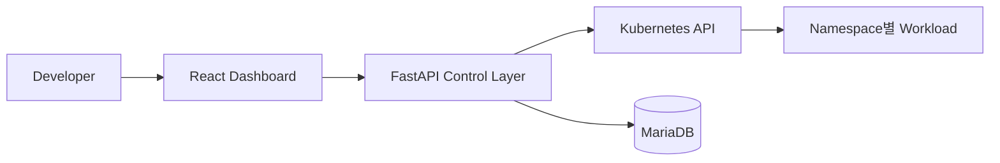
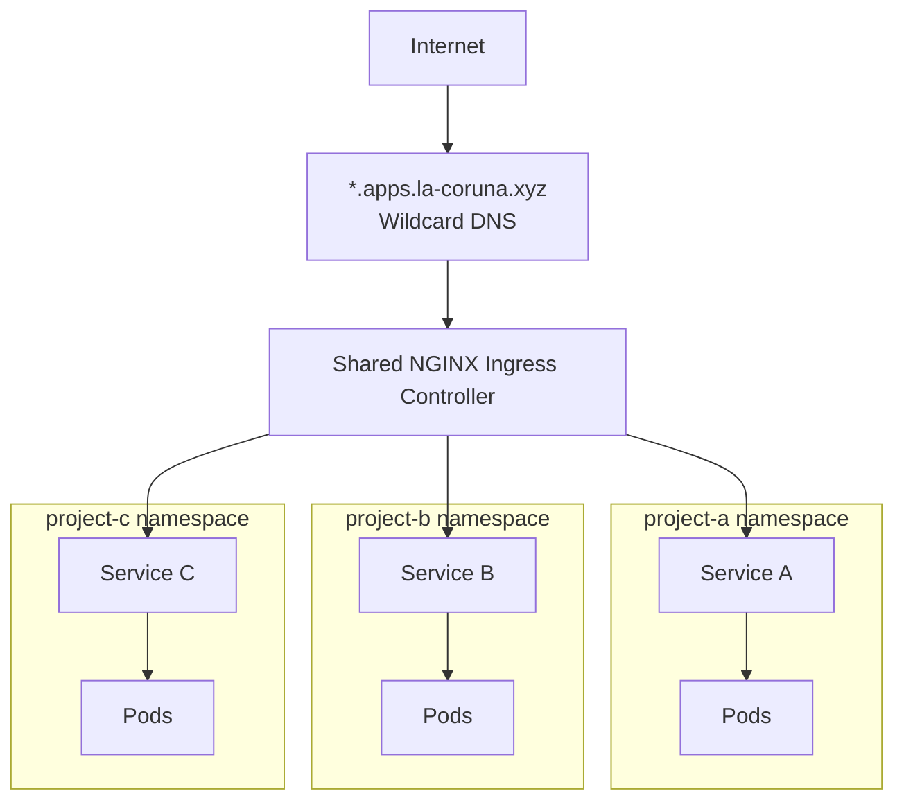

<p><a class="btn btn--primary" href="http://portal.la-coruna.xyz/" target="_blank" rel="noopener noreferrer">플랫폼 체험하기 <span aria-hidden="true">↗</span><span class="screen-reader-text"> (새 탭에서 열림)</span></a></p>

## Project Overview

**개발자는 애플리케이션 실행 의도만 입력하고, 플랫폼은 Kubernetes 리소스 구성·운영 규칙·상태 진단을 책임하도록 만든 셀프서비스 배포·운영 플랫폼입니다.**

사용자는 Kubernetes YAML과 명령어를 직접 다루지 않고 **서비스명, 실행 환경, 컨테이너 이미지, 자원 정보, 외부 공개 여부**를 입력합니다. 플랫폼은 이를 표준 Kubernetes 리소스로 변환하고, 배포 이후의 실제 실행 상태와 실패 원인까지 보여줍니다.

핵심 과제는 개발자의 배포 부담을 줄이면서도 리소스 이름, 격리 기준, 자원 제한, 외부 공개 정책과 변경 이력을 운영자가 통제할 수 있게 하는 것이었습니다. 따라서 단순한 리소스 생성 API가 아니라 **신청 → 생성 → 상태·실패 원인 확인 → 외부 접근 → 삭제 → 이력 보존**의 전체 생명주기를 범위로 잡았습니다.

---

## Architecture



React Dashboard는 배포 의도 입력과 상태 확인을 담당합니다. FastAPI는 사용자 요청과 Kubernetes 사이의 **Control Layer**로서 입력 검증, 리소스 생성·조회·삭제와 플랫폼 상태 전이를 조정합니다.

Kubernetes에는 실제 워크로드 상태를 두고, MariaDB에는 요청 정보·플랫폼 상태·상태 이력·리소스 메타데이터·최근 오류·Audit Log를 저장해 두 상태의 책임을 분리했습니다.

| 영역 | 역할 |
| --- | --- |
| Frontend | 프로젝트 신청, Pod·Event·작업 이력 표시 |
| Backend | 입력 검증, Kubernetes API 연동, 생명주기 제어 |
| Kubernetes | Namespace, ResourceQuota, Deployment, Service, Ingress의 실제 상태 |
| MariaDB | 요청 정보, 플랫폼 상태, 메타데이터, Audit Log 보존 |

---

## Platform Design

### 애플리케이션 실행 의도와 인프라 구현을 분리

사용자가 표현해야 하는 것은 Kubernetes 리소스 자체가 아니라 **어떤 애플리케이션을 어떤 조건으로 실행하고 싶은지**라고 판단했습니다.

따라서 서비스 특성에 따라 달라지는 값은 사용자에게 입력받고, 조직 전체에서 일관되어야 하는 값은 플랫폼이 관리하도록 추상화 경계를 정했습니다.

| 사용자가 결정 | 플랫폼이 결정 |
| --- | --- |
| 서비스명, 실행 환경, 이미지 | Namespace와 리소스 이름 규칙 |
| Replica, CPU·Memory, Port | Label·Selector, ResourceQuota |
| 외부 공개 여부 | Service 유형, Ingress Host, 생성·삭제 순서 |

플랫폼은 다음 운영 규칙을 **Guardrail**로 적용합니다.

- 서비스·환경별 Namespace로 리소스를 격리합니다.
- ResourceQuota로 Namespace 단위 자원 사용 범위를 제한합니다.
- 공통 Label을 적용해 플랫폼이 관리하는 리소스를 식별하고 조회·삭제의 기준으로 사용합니다.
- Service는 ClusterIP로 생성하고 외부 공개를 요청한 경우에만 Ingress를 구성합니다.
- 로컬에서는 `kind`, 외부 환경에서는 `GKE`를 대상으로 동일한 배포 흐름을 검증했습니다.

> 셀프서비스는 모든 설정을 자유롭게 허용하는 것이 아니라, 사용자가 필요한 자원을 스스로 요청하되 실제 생성은 플랫폼의 규칙과 제한 안에서 이루어지도록 하는 것이라고 정의했습니다.


---

## Key Implementation

### 1. 리소스 생성

생성 요청은 입력값을 검증한 뒤 다음 순서로 처리합니다.

```text
Namespace
→ ResourceQuota
→ Deployment
→ Service
→ Ingress (외부 공개 시)
```

리소스 이름, Label·Selector, Namespace 구성, 외부 공개 방식은 플랫폼이 일관된 규칙으로 생성합니다.

### 2. 플랫폼 상태 관리

프로젝트의 생명주기는 다음 상태로 관리합니다.

```text
REQUESTED → PROVISIONING → RUNNING
                    └──→ FAILED

RUNNING / FAILED → DELETING → DELETED
```

Kubernetes API가 리소스 생성을 수락했다고 해서 실제 애플리케이션 실행이 성공한 것은 아니므로, 생성 요청의 처리 상태와 실제 클러스터 상태를 분리했습니다.

### 3. 상태 조회 및 동기화

상태 판단에는 Pod Phase만 사용하지 않고 다음 정보를 함께 조회합니다.

- Pod Phase
- Ready 여부
- Container State
- Waiting Reason
- Restart Count
- Node
- Pod IP
- Kubernetes Event

**현재 MVP에서는 사용자의 상태 조회·동기화 요청 시 Kubernetes API에서 실제 상태를 읽고 DB의 플랫폼 상태를 갱신합니다.**

따라서 현재 구현은 Kubernetes Controller처럼 클러스터 변화를 지속적으로 감시하는 구조가 아닙니다. 운영 환경에서는 Watch 또는 Reconciliation Loop를 통해 DB의 기대 상태와 Kubernetes 실제 상태를 지속적으로 비교하는 구조로 확장할 수 있습니다.

### 4. 삭제와 이력 보존

삭제는 다음 순서로 처리합니다.

```text
Ingress
→ Service
→ Deployment
→ ResourceQuota
→ Namespace
```

Namespace만 삭제해도 하위 리소스가 함께 정리될 수 있지만, 이 프로젝트에서는 **리소스별 삭제 결과와 실패 원인을 기록하고 삭제 과정을 명시적으로 제어하기 위해** 개별 리소스를 먼저 정리한 뒤 Namespace를 최종 삭제하도록 설계했습니다.

삭제 후 프로젝트 레코드는 제거하지 않고 `DELETED` 상태와 삭제 시각을 보존하며, Audit Log에 처리 결과를 남겨 중복 삭제 요청을 방지하고 작업 이력을 추적할 수 있게 했습니다.

---

## Technical Decisions

### 1. Kubernetes 실제 상태와 플랫폼 비즈니스 상태를 왜 분리했는가

Kubernetes API가 Deployment 생성을 수락해도 애플리케이션이 정상적으로 실행됐다는 의미는 아닙니다.

또한 Kubernetes의 `Pending`, `Running`과 같은 상태는 워크로드 실행 상태를 나타내지만, 사용자가 요청한 작업의 생명주기인 `REQUESTED`, `PROVISIONING`, `RUNNING`, `FAILED`, `DELETED`와는 의미가 다릅니다.

따라서 다음 두 상태를 분리했습니다.

```text
Kubernetes 실제 상태
- Pod Phase
- Ready
- Container State
- Waiting Reason
- Event

플랫폼 상태
- REQUESTED
- PROVISIONING
- RUNNING
- FAILED
- DELETING
- DELETED
```

상태 동기화 시 Kubernetes의 실제 신호를 분석해 플랫폼 상태를 갱신하고 상태 변경 이력을 남겨, 자동화가 블랙박스가 되지 않도록 했습니다.

---

### 2. 외부 공개를 왜 프로젝트별 LoadBalancer가 아니라 공유 Ingress 구조로 바꿨는가

초기에는 프로젝트마다 GKE Ingress와 Load Balancer를 만드는 구성을 검토했습니다. 그러나 애플리케이션이 늘어날수록 외부 공개 리소스와 DNS를 개별 관리해야 하고 비용·운영 복잡도도 함께 증가했습니다.

따라서 포털과 사용자 애플리케이션의 외부 공개 구조를 분리했습니다.

- 포털: GCE Ingress를 통해 `portal.la-coruna.xyz`로 노출
- 사용자 애플리케이션: 공유 NGINX Ingress Controller 사용
- DNS: `*.apps.la-coruna.xyz` 와일드카드 규칙 사용
- Host: `{service-name}-{environment}.apps.la-coruna.xyz`



이를 통해 사용자 애플리케이션마다 별도의 외부 Load Balancer를 두기보다 **공유 Ingress 계층과 일관된 Host 규칙을 제공하는 구조**로 단순화했습니다.

---

### 3. 왜 Direct Apply 방식으로 시작했는가

MVP에서는 FastAPI가 Kubernetes Python Client를 사용해 Kubernetes API에 직접 리소스를 생성합니다.

```text
FastAPI
→ Kubernetes Python Client
→ Kubernetes API Server
→ Namespace / Deployment / Service / Ingress
```

초기 목표는 Kubernetes API의 실제 동작과 상태 변화를 직접 이해하면서 셀프서비스 프로비저닝과 상태 진단 흐름을 검증하는 것이었기 때문에 Direct Apply 방식으로 구현했습니다.

운영 환경에서는 Helm Values를 Git에 저장하고 ArgoCD가 반영하는 GitOps 구조로 확장하면 변경 이력, Diff, Rollback, Drift 감지를 강화할 수 있습니다.

```text
사용자 요청
→ FastAPI
→ Helm Values 생성
→ Git Commit
→ ArgoCD Sync
→ Kubernetes 반영
```

---

## Troubleshooting

### 리소스 생성 성공과 애플리케이션 실행 성공은 다르다

Kubernetes API에서 Namespace, Deployment, Service 생성 요청이 성공해도 실제 Pod 내부에서 애플리케이션이 정상적으로 실행된다고 보장할 수 없습니다.

따라서 정상 이미지 배포만 확인하는 데 그치지 않고 원인이 서로 다른 실패 시나리오를 의도적으로 재현했습니다.

| 시나리오 | Kubernetes 신호 | 판별 기준 |
| --- | --- | --- |
| 존재하지 않는 이미지 | `ErrImagePull` → `ImagePullBackOff` | Container Waiting Reason과 이미지 Pull 관련 Event |
| 프로세스 반복 종료 | `CrashLoopBackOff`, Restart Count 증가 | Container State와 재시작 BackOff Event |

> `ImagePullBackOff`, `CrashLoopBackOff`는 Pod Phase 자체가 아니라 컨테이너의 Waiting Reason에서 관찰되는 신호입니다.

<figure class="screenshot-window">
  
  <figcaption>ImagePullBackOff 실패 원인과 Kubernetes Event를 함께 표시한 화면</figcaption>
</figure>

### Scenario 1. ImagePullBackOff

존재하지 않는 이미지인 다음 주소를 배포했습니다.

```text
does-not-exist.local/broken/nginx:missing
```

Deployment와 Pod는 생성됐지만 이미지를 가져오지 못했고 다음 흐름을 확인했습니다.

```text
Pod 생성
→ 이미지 Pull 시도
→ ErrImagePull
→ 재시도
→ ImagePullBackOff
```

화면에서는 다음 정보를 함께 확인할 수 있도록 했습니다.

```text
Pod Phase       Pending
Ready           false
Container State waiting
Waiting Reason  ImagePullBackOff
Event           Failed / BackOff
```

### Scenario 2. CrashLoopBackOff

이미지 Pull에는 성공하지만 컨테이너 내부 프로세스가 반복 종료되도록 구성했습니다.

이 경우 Pod가 `Running`으로 보일 수 있어 Phase만으로는 애플리케이션의 정상 동작을 판단할 수 없었습니다. 따라서 Container State, Waiting Reason, Restart Count와 Event를 함께 조회해 `CrashLoopBackOff`를 판별했습니다.

이를 통해 **Pod Phase 하나가 아니라 여러 Kubernetes 신호를 조합해야 실제 실행 상태를 판단할 수 있다**는 점을 검증했습니다.

---

## Validation

프로젝트에서는 다음 흐름을 실제로 검증했습니다.

| 검증 항목 | 확인 내용 |
| --- | --- |
| 정상 배포 | 표준 리소스 생성, Pod Running·Ready |
| 외부 공개 | Ingress 생성 및 외부 Host 접근 |
| 이미지 Pull 실패 | `ErrImagePull` → `ImagePullBackOff`와 Event 표시 |
| 프로세스 반복 종료 | `CrashLoopBackOff`, Restart Count 증가 확인 |
| 상태 동기화 | Kubernetes 실제 상태를 조회해 플랫폼 상태 갱신 |
| 삭제 | 리소스 정리 후 `DELETED` 상태·삭제 시각·Audit Log 보존 |
| 실행 환경 | kind와 GKE에서 배포 흐름 검증 |

정량적인 생산성 향상 수치는 별도로 측정하지 않았기 때문에 임의로 기재하지 않았습니다. 대신 정상·실패·삭제 시나리오와 실제 Kubernetes 상태를 통해 플랫폼 동작을 검증했습니다.

---

## Result / Learned

### 1. 플랫폼은 복잡성을 없애는 것이 아니라 책임을 재배치하는 일이다

Kubernetes의 복잡성 자체가 사라지는 것은 아닙니다. 사용자가 직접 처리하던 Namespace, Naming, Label·Selector, ResourceQuota, Ingress 구성과 생성 순서를 플랫폼이 대신 책임하게 됩니다.

따라서 좋은 추상화는 모든 것을 감추는 것이 아니라 **사용자가 알 필요 없는 구현 세부사항은 플랫폼이 처리하고, 상태와 실패 원인처럼 판단에 필요한 정보는 다시 사용자에게 제공하는 것**이라고 배웠습니다.

### 2. 셀프서비스와 운영 통제는 함께 설계할 수 있다

셀프서비스를 위해 모든 선택지를 열어두는 대신 Naming Convention, ResourceQuota, Label, 외부 공개 정책과 같은 Guardrail을 적용했습니다.

이를 통해 개발자는 반복적인 인프라 판단을 줄이고, 운영자는 일관된 기준으로 리소스를 관리할 수 있었습니다.

### 3. 플랫폼은 생성보다 전체 생명주기를 관리해야 한다

리소스 생성 요청이 성공하는 것만으로는 운영 가능한 플랫폼이 되지 않습니다.

실제 워크로드의 상태 진단, 실패 원인 제공, 삭제, 상태 이력과 Audit Log까지 포함해야 사용자가 플랫폼을 신뢰하고 운영자가 변경 과정을 추적할 수 있음을 배웠습니다.

---

## Current Limitations / Next Steps

현재 프로젝트는 **셀프서비스 프로비저닝과 상태 진단을 검증하는 MVP**입니다. 운영급 환경으로 확장하기 위해서는 다음 과제가 남아 있습니다.

- 사용자 인증·인가 및 ServiceAccount/RBAC 기반 최소 권한 제어
- 동기 API 호출을 분리한 비동기 Provisioning
- Kubernetes Watch/Reconciliation 기반 지속적인 상태 동기화
- Helm·ArgoCD 기반 GitOps
- Prometheus/Grafana 및 중앙 로그 기반 관측성 고도화
- 멀티 클러스터·멀티 테넌트 운영 정책

MVP 단계에서는 기능 범위를 무리하게 넓히기보다 **개발자의 실행 의도를 표준 Kubernetes 리소스로 변환하고, 실제 상태와 실패 원인을 다시 사용자에게 제공하는 전체 흐름**을 검증하는 데 집중했습니다.
