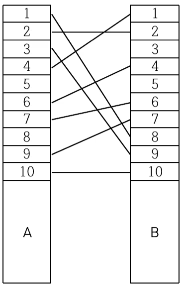

## 🔗Link
{:.no-top-margin}
[문제](https://boj.kr/2565)  
[풀이](https://github.com/La-Coruna/PS/blob/main/baekjoon/2565.cpp)

## 💡Idea

### 사고 흐름
1. 교차하지 않는 전깃줄들의 모임은, 전깃줄이 연결된 B의 번호가 오름차순이겠다.
2. B의 번호가 오름차순이 되도록 하는 전깃줄들의 모임 중 전깃줄의 개수가 가장 많은 것을 찾고, 거기에 포함되지 않은 전깃줄을 제거하면 되겠다.
3. 즉, 가장 긴 증가하는 부분 수열 문제로 볼 수 있겠다.
	- LIS 알고리즘은 DP를 활용하여 O(nlgn)으로 풀 수 있다.

## 풀이 흐름
1. 입력된 전깃줄을 A번호로 정렬한다.
2. B의 번호로, LIS 알고리즘을 사용한다.
3. 전체 개수에서 최장 증가하는 부분 수열의 길이를 뺀 것이 정답.

## 🔑Code
```c++
#include <bits/stdc++.h>
using namespace std;

int N;
int dp[101];

int main(void){
    ios_base::sync_with_stdio(0);
    cin.tie(0);

    cin >> N;
    vector<pair<int,int>> arr;
    for(int i = 0; i < N; i++){
        int u, v;
        cin >> u >> v;
        arr.emplace_back(u,v);
    }

    // 1. 왼쪽 번호로 정렬
    sort(arr.begin(), arr.end());

    // 2. 가장 큰 부분수열의 길이 X 구하기. -> DP
    int cur_max_length = 0;
    for(int i = 0; i < N; i++){
        int cur_value = arr[i].second;
        auto a = lower_bound(dp, dp+cur_max_length, cur_value);

        // 값이 없거나, 더 작으면 갱신
        if(*a == 0){
            *a = cur_value;
            cur_max_length++;
        }   
        else if(cur_value < *a) *a = cur_value;
    }

    cout << N - cur_max_length;
    
    return 0;
}
```

## 🗨️ Side Notes