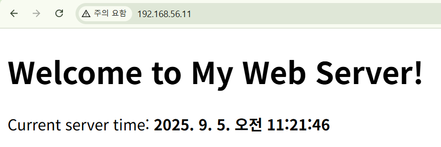
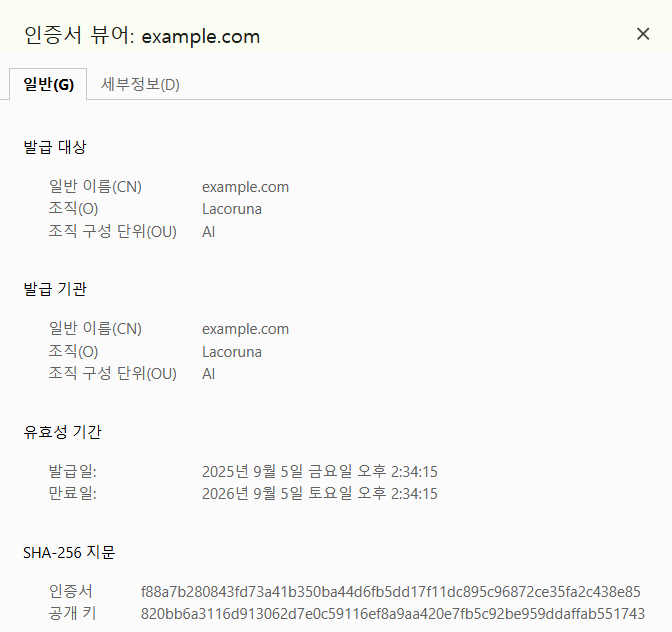

## Apache 웹 서버

### 웹 기초 지식
- 정적 콘텐츠: 데이터의 변경이 없는 콘텐츠 (html, css, js, 이미지 등)
- 동적 콘텐츠: 데이터가 변경될 수 있는 콘텐츠 (jsp, php, asp 등의 확장자)

- 웹 어플리케이션 모듈: 동적 콘텐츠의 코드를 실행하기 위한 존재. 실행된 결과를 정적 콘텐츠로 생형하여 웹 서버에게 전달.
- 웹 서버: 정적 콘텐츠를 클라이언트에게 전송

### 웹 서버 구성
#### 실습: 아파치 웹 서버 준비
- 아파치 웹 서버 설치
```
[vagrant@user01 ~]$ sudo yum install httpd -y
```

- 서비스 실행
```
[vagrant@user01 ~]$ sudo systemctl start httpd
```

- 방화벽 설정
  ```
  [vagrant@user01 ~]$ sudo firewall-cmd --add-service=http
  success
  [vagrant@user01 ~]$ sudo firewall-cmd --add-service=http --permanent
  success

  [vagrant@user01 ~]$ sudo firewall-cmd --list-services
  cockpit dhcpv6-client http ssh
  ```

- `curl`로 테스트 페이지 확인
  ```
  [vagrant@user01 ~]$ curl localhost
  <!doctype html>
  <html>
  ...생략
  </html>
  ```
- `curl`는 client for URL의 약자라고 한다. see URL에서 따왔다는 이야기도 있다.

- 기본 설정 파일을 읽어보자.
```bash
[vagrant@user01 ~]$ sudo vi /etc/httpd/conf/httpd.conf
```

- 중요한 부분들을 읽어보자.
  ```bash
  # 서버의 루트
  ServerRoot "/etc/httpd"

  # 요청 받을 포트
  Listen 80

  # 사용자 및 그룹
  User apache
  Group apache
  # 만약 여기가 root면 보안 상 위험하겠다.
  # 만약 해커가 들어왔을 때 apache 사용자 권한이 아닌 root 사용자 권한이라면 피해가 더 클 것이다.

  # 웹 문서가 들어갈 디렉토리의 루트
  DocumentRoot "/var/www/html"
  ```

#### 실습: 서버에 웹 페이지를 올려보자

- 기본 문서 디렉토리에 html 파일 생성
```
[vagrant@user01 ~]$ sudo vi /var/www/html/index.html
```
- 내용은 적당히 작성하자.



### 가상 호스트 구성
- 하나의 물리적인 웹 서버에서 여러개의 웹 사이트를 서비스할 수 있도록 구성하는 것

- 구성 방식
	- 이름 기반 가상 호스트(Name-Based Virtual Host)
	- IP 기반 가상 호스트(IP-Based Virtual Host)
	- 포트 기반 가상 호스트(Port-Based Virtual Host)
#### 실습: 이름 기반 가상 호스트(Name-Based Virtual Host)

- hosts 설정을 해두자.
  ```
  [vagrant@user01 ~]$ sudo vi /etc/hosts

  # 아래에 두 줄을 추가해줬다.
  [vagrant@user01 ~]$ tail -n2 /etc/hosts
  192.168.56.11 first.example.com
  192.168.56.11 second.example.com
  ```

- ping으로 확인
  ```
  [vagrant@user01 ~]$ ping first.example.com -c 2
  PING first.example.com (192.168.56.11) 56(84) bytes of data.
  64 bytes from first.example.com (192.168.56.11): icmp_seq=1 ttl=64 time=0.211 ms
  64 bytes from first.example.com (192.168.56.11): icmp_seq=2 ttl=64 time=0.105 ms

  --- first.example.com ping statistics ---
  2 packets transmitted, 2 received, 0% packet loss, time 1065ms
  rtt min/avg/max/mdev = 0.105/0.158/0.211/0.053 ms
  ```

- 가상호스트 설정 파일 생성
	- 기존 설정 파일과 별개로 가상 호스트를 설정하기 위한 설정 파일을 생성해야 한다.  

  ```bash
  [vagrant@user01 ~]$ sudo vi /etc/httpd/conf.d/vhosts.conf

  # 작성 내용
  [vagrant@user01 ~]$ cat /etc/httpd/conf.d/vhosts.conf
  # 첫 번째 가상 호스트  
  <VirtualHost *:80>  
      ServerName first.example.com  
      DocumentRoot "/var/www/first"  
    
  <Directory "/var/www/first">  
          AllowOverride None  
          Require all granted  
      </Directory>  
  </VirtualHost>  
    
  # 두 번째 가상 호스트  
  <VirtualHost *:80>  
      ServerName second.example.com  
      DocumentRoot "/var/www/second"  
       
      <Directory "/var/www/second">  
          AllowOverride None  
          Require all granted  
      </Directory>  
  </VirtualHost>
  ```
- `<VirtualHost *:80>` : 모든 IP주소의 80번 포트에서 동작한다
- `ServerName`: 클라이언트가 보낸 Host(HTTPS는 SNI) 값이 ServerName과 같을 때 이 vhost가 선택되도록.
- `DocumentRoot`: 각각의 가상호스트가 사용할 document directory를 따로 설정해두고 있다.
	- `/var/www/first`와 `/var/www/second`로 분리해서 관리할 수 있도록.

- 자. 설정 파일을 바꿔줬다면 무엇을 해야겠는가!?
	- 설정 파일을 적용하기 위해선 서비스를 종료하고 재시작해야 한다.
```
[vagrant@user01 ~]$ sudo systemctl restart httpd
```

- 설정한 DocumentRoot의 디렉토리와 테스트 페이지를 하나씩 만들어주자.
  ```
  [vagrant@user01 ~]$ sudo mkdir /var/www/first
  [vagrant@user01 ~]$ sudo mkdir /var/www/second

  [vagrant@user01 ~]$ echo "<h1>First Test</h1>" | sudo tee /var/www/first/index.html
  <h1>First Test</h1>
  [vagrant@user01 ~]$ echo "<h1>Second Test</h1>" | sudo tee /var/www/second/index.html
  <h1>Second Test</h1>
  ```

- curl로 확인해보자.
  ```
  [vagrant@user01 ~]$ curl first.example.com
  <h1>First Test</h1>
  [vagrant@user01 ~]$ curl second.example.com
  <h1>Second Test</h1>
  ```

#### IP 기반 가상 호스트(IP-Based Virtual Host)
- 서버에 인터페이스가 여러 개 있거나

- 실습을 위해 인터페이스를 하나 추가하겠다.
  ```
  [vagrant@user01 ~]$ sudo nmcli connection modify System\ enp0s8 +ipv4.addresses 192.168.56.12/24

  [vagrant@user01 ~]$ sudo nmcli connection up System\ enp0s8
  Connection successfully activated (D-Bus active path: /org/freedesktop/NetworkManager/ActiveConnection/4)
  ```

- `ip a` 로 확인
```
[vagrant@user01 ~]$ ip a | grep 19
    inet 192.168.56.11/24 brd 192.168.56.255 scope global noprefixroute enp0s8
    inet 192.168.56.12/24 brd 192.168.56.255 scope global secondary noprefixroute enp0s8
```

- 가상 호스트 설정 파일 생성
  ```
  [vagrant@user01 ~]$ sudo vi /etc/httpd/conf.d/vhosts.ip.conf
  [vagrant@user01 ~]$ cat /etc/httpd/conf.d/vhosts.ip.conf
  # 첫 번째 가상 호스트
  <VirtualHost 192.168.56.11:80>
      ServerName first.example.com
      DocumentRoot "/var/www/first"

      <Directory "/var/www/first">
          AllowOverride None
          Require all granted
      </Directory>
  </VirtualHost>

  # 두 번째 가상 호스트
  <VirtualHost 192.168.56.12:80>
      ServerName second.example.com
      DocumentRoot "/var/www/second"

      <Directory "/var/www/second">
          AllowOverride None
          Require all granted
      </Directory>
  </VirtualHost>
  ```

- 자. 설정 파일을 바꿔줬다면 무엇을 해야겠는가!?!?!?!?
	- 설정 파일을 적용하기 위해선 서비스를 종료하고 재시작해야 한다.
```
[vagrant@user01 ~]$ sudo systemctl restart httpd
```

- `curl`로 확인해보자.
  ```
  [vagrant@user01 ~]$ curl 192.168.56.11
  <h1>First Test</h1>
  [vagrant@user01 ~]$ curl 192.168.56.12
  <h1>Second Test</h1>
  ```

### HTTPS 구성
- HTTP는 평문 전송이라는 단점이 있음.
- 이를 해결하고자, HTTPS가 등장.
- HTTPS는 응용계층 프로토콜인 HTTP보다 낮은 계층에서, SSL/TLS 프로토콜을 통해 전송되는 데이터를 암호화한다.

>SSL(Secure Socket Layer): Netscape사에서 전송되는 데이터를 암호화하기 위해 개발.
>TLS(Transport Layer Security): SSL v3이 발표되고 보안이 강화되면서 표준화해서 붙인 이름.

HTTPS 사용 이유
1. 데이터 암호화
2. 데이터 무결성
3. 인증
4. SEO(검색 엔진 최적화) 향상

- 보안에서는 암호화가 제일 싸다고 표현한다.

#### 실습
- 실제로 https를 사용하기 위해선 돈을 내고 인증을 받아야 한다.
- 우리는 그냥 스스로 인증하는 실습(자체 서명)을 해보자.
- 자체 서명 인증서를 쓰면 브라우저가 '신뢰되지 않음' 경고를 띄우지만, 연결은 여전히 HTTPS(암호화)로 동작한다.

##### 1. 개인키 생성
- 인증에 사용할 키를 만들어보자.
  ```
  [vagrant@user01 ~]$ sudo openssl genrsa -out /etc/pki/tls/private/example.key 2048

  [vagrant@user01 ~]$ sudo ls -l /etc/pki/tls/private/example.key
  -rw-------. 1 root root 1704 Sep  5 05:21 /etc/pki/tls/private/example.key
  ```
- 키의 길이(현재는 2048)가 늘어날 수록 안전하다.


##### 2. 인증서 서명 요청 CSR을 생성해보자.
- CSR(Certificate Signing Request): 서버 인증서를 발급 받기 위해 필요한 서명 요구

- 우리의 키를 `/tmp/example.csr`위치에 옮겨주자.
```
[vagrant@user01 ~]$ sudo openssl req -new -key /etc/pki/tls/private/example.key -out /tmp/example.csr -subj "/C=KR/ST=Seoul/L=Seoul/O=Lacoruna/OU=AI/CN=example.com"
```
- `/C=KR/ST=Seoul/L=Seoul/O=Lacoruna/OU=AI/CN=example.com`: 국가, 주/도, 지역, 회사명, 조직단위, Common Name(웹 사이트 도메인)
- CN은 실제 서비스할 도메인 명과 정확히 일치해야 한다.
	- 어차피 우리가 우리를 인증하는 거라, 나머지 내용들은 좀 잘못되어도 크게 문제 없긴 하다.

- csr요청을 만든다.
```
[vagrant@user01 ~]$ sudo openssl x509 -req -days 365 -in /tmp/example.csr -signkey /etc/pki/tls/private/example.key -out /etc/pki/tls/certs/example.crt
Certificate request self-signature ok
subject=C=KR, ST=Seoul, L=Seoul, O=Lacoruna, OU=AI, CN=example.com
```
- 자체 서명할 사인을 우리의 키로 한다.
##### 3. 이제 SSL/TLS 설정을 해보자.

- `mod_ssl` 패키지를 설치해야 한다.
```
[vagrant@user01 ~]$ sudo yum -y install mod_ssl
```

- SNI 기반 이름 기반 가상호스트
- HTTPS는 먼저 SNI로 **어느 도메인의 인증서**를 낼지 결정하고, TLS가 성립된 뒤에 Host 헤더로 애플리케이션 라우팅을 한다.
  ```
  [vagrant@user01 ~]$ sudo vi /etc/httpd/conf.d/vhosts.ssl.conf

  [vagrant@user01 ~]$ cat /etc/httpd/conf.d/vhosts.ssl.conf
  <VirtualHost *:443>
      ServerName https.example.com
      DocumentRoot "/var/www/html"

      SSLEngine on
      SSLCertificateFile /etc/pki/tls/certs/example.crt
      SSLCertificateKeyFile /etc/pki/tls/private/example.key

      <Directory "/var/www/html">
          AllowOverride None
          Require all granted
      </Directory>
  </VirtualHost>
  ```

- 설정을 바꿨다면 뭐? 재시작을 해줘야 한다.
```
[vagrant@user01 ~]$ sudo systemctl restart httpd
```

- 방화벽도 열어주자.
  ```
  [vagrant@user01 ~]$ sudo firewall-cmd --list-services
  cockpit dhcpv6-client dns http ssh

  [vagrant@user01 ~]$ sudo firewall-cmd --add-service=https
  success
  [vagrant@user01 ~]$ sudo firewall-cmd --add-service=https --permanent
  success
  ```

- 호스트 PC(VM을 돌리는 PC)의 브라우저로 접근해 보았다.

- 인증서 정보가 잘 나온다.