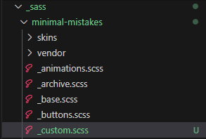

# 서론
글을 쓰는 도중, 글에 박스를 치고 싶어 `{: .notice}`를 사용해보았다. 이를 사용하니 박스 안의 글씨가 작아지고, 위 아래로 마진값이 있는 것이 맘에 들지 않았다. 그래서 맘에 드는 `{: .my_notice}`를 하나 새로 만들기로 했다. 기존에 minimal mistakes의 설정을 바꾸고자 한다면, 다음 과정을 따라하면 되겠다.

# 과정
1. **_sass > minimal-mistakes > _custom.scss 추가**  
     
2. **_custom.scss 원하는 설정을 작성**  
    ```scss
    @mixin my_notice($notice-color) {
        margin: 0 0 0 0 !important;  // 마진 없애기
        //font-size: $type-size-6 !important; // 폰트 사이즈 설정 삭제

        // 이하 생략
    }

    .my_notice {
        @include my_notice($light-gray);
    }
    ```
    
3. **_sass > minimal-mistakes.scss에 반영**  
    ```scss
    /* Customs */
    @import "minimal-mistakes/custom";
    ```

# 결과
- 기존 notice  

    기존 notice
    {: .notice}

- 새로 만든 my_notice  

    새로 만든 my_notice
    {: .my_notice}