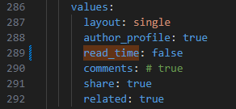
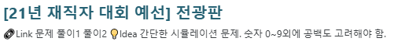
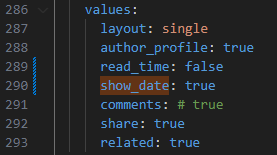

## 예상 읽기 시간이란?
아래와 같이 블로그 포스팅을 읽는 데 소요되는 시간을 표시하는 기능이다. ("⏱1분 소요")  
  
{: .rounded-border }  

## 예상 읽기 시간 표시 해제 방법
`_config.yml` 파일에서 아래와 같이 설정하면 예상 읽기 시간을 비활성화할 수 있다.
```yaml
read_time: false
```
{: .rounded-border }    

{: .rounded-border }  

## 포스팅 작성 날짜 표시하기
`_config.yml`에서 show_date를 true로 설정해주면 포스팅 작성 날짜를 표시할 수 있다.  
포스팅 작성 날짜는 포스팅 파일에서 읽어온다.  
예상 읽기 시간이 사라져서 허전한 자리를 메꾸기 좋다.
```yaml
show_date: true
```
   
{: .rounded-border }  
  
{: .rounded-border }  