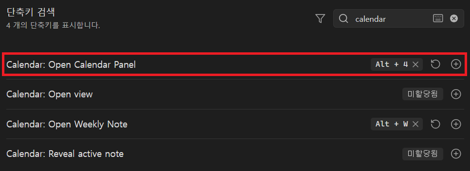
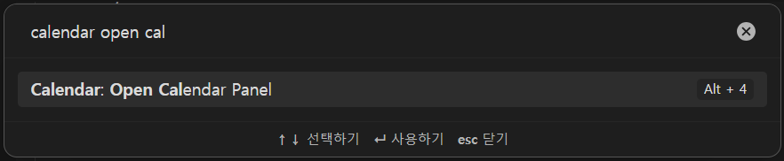
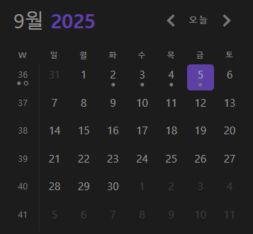

## 서론
옵시디언의 calendar라는 캘린더를 표시해주고, 일일 노트들과 연결해주는 플러그인이 있다.  
단축키로 이 calendar를 열고 싶은데, 단축키를 매핑할 수 있는 항목이 없다.  
그래서 단축키를 설정할 수 있도록 설정을 해보겠다.  
  
위 이미지의 빨간 박스 부분이 새로 추가한 단축키 항목이다.

## 문제 이해
- Q1) 왜 단축키를 등록을 못할까?
- A1) 관련 커맨드가 없기 때문이다.
	- 커맨드는 Command palette(`Ctrl` + `P`)를 통해 사용할 수 있다.
<br><br>
- Q2) 커맨드는 어떻게 등록하나?
- A2) 옵시디언 공식 문서를 찾아보자.
	- [옵시디언 공식 문서](https://docs.obsidian.md/Plugins/User+interface/Commands)
	- "To register a new command for your plugin, call the [addCommand()](https://docs.obsidian.md/Reference/TypeScript+API/Plugin/addCommand) method inside the `onload()` method"
	- `onload()` 내부에 `addCommand()`를 호출하여 등록한다고 한다.
<br><br>
- Q3) 그러면 이제, 명령어에 단축키 등록은 어떻게 하나?
- A3) 공식 문서의 Hot keys 부분을 보면 다음과 같이 설명되어 있다.
	- "The user can run commands using a keyboard shortcut, or _hot key_. While they can configure this themselves, you can also provide a default hot key."
	- 즉, 코드 단에서 디폴트 값을 설정할 수도 있고, 사용자가 직접 설정할 수도 있다.
<br><br>
- 결론: 그러면 커맨드를 만들고, hot key를 설정해주면 되겠다.

## 해결 방법
- 플러그인 파일들은 `{vault name}/.obsidian/plugins`에 위치하고 있다.

- `onload()` 내부에 `addCommand()`를 호출하여 새로운 커맨드를 작성해주자.
  ```js
  // /.obsidian/plugins/calendar/main.js

  this.addCommand({
    id: "show-calendar-view",
    name: "Open view",
    checkCallback: (checking) => {
      if (checking) {
        return (this.app.workspace.getLeavesOfType(VIEW_TYPE_CALENDAR).length === 0);
      }
      this.initLeaf();
    },
  });
  ```

## 결과
- 커맨드 팔레트에 새로 추가한 커맨드를 입력한 모습이다.
- 단축키는 `Alt` + `4`로 설정해두었다.
	

- 단축키로 귀여운 달력이 잘 열린다.  
	

## 참고 자료
- [https://docs.obsidian.md/Plugins/User+interface/Commands](https://docs.obsidian.md/Plugins/User+interface/Commands)